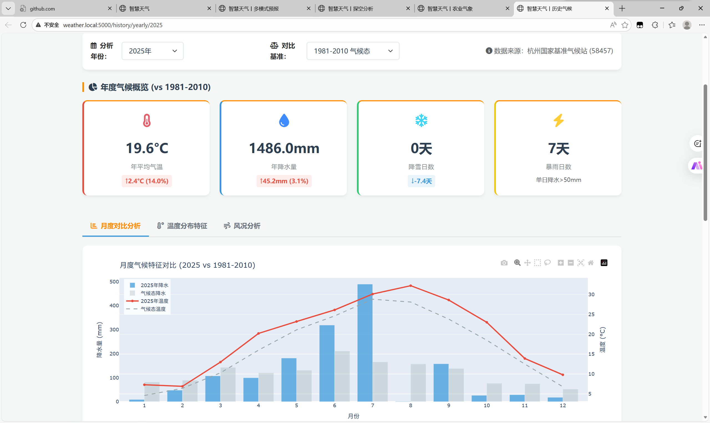

# 📖 用户手册

欢迎使用「智慧天气」综合气象服务系统！本手册将帮助您快速上手使用各功能模块。

---

## 目录

1. [系统概述](#1-系统概述)
2. [首页](#2-首页)
3. [多模式预报](#3-多模式预报)
4. [探空分析](#4-探空分析)
5. [农业气象](#5-农业气象)
6. [历史气候](#6-历史气候)
7. [常见问题](#7-常见问题)

---

## 1. 系统概述

### 1.1 适用对象

本系统适合以下用户：
- 🌾 农业从业者（农户、农技人员）
- 🎈 气象爱好者
- 📊 需要天气信息的普通用户

### 1.2 功能简介

| 模块 | 功能 | 入口 |
|------|------|------|
| 🏠 首页 | 项目概览、快速导航 | `/` |
| 📊 多模式预报 | ECMWF/GFS/ICON 数值预报 | `/advanced-forecast` |
| 🎈 探空分析 | 大气垂直结构分析 | `/upperair` |
| 🌾 农业气象 | 作物积温预测与农事建议 | `/agro-dashboard` |
| 📜 历史气候 | 杭州历史气候数据 | `/history/yearly` |

---

## 2. 首页

### 2.1 页面概览


首页展示以下内容：

| 区域 | 说明 |
|------|------|
| **顶部导航** | 各模块快速入口 |
| **天气卡片** | 当前杭州天气实况（温度、湿度、风速、天气现象） |
| **模块入口** | 四个功能模块的卡片导航 |
| **系统状态** | 各模块运行状态指示灯 |

### 2.2 快速导航

点击任意模块卡片即可进入对应功能页面：
- 📊 **多模式预报**：查看未来7天天气预报
- 🎈 **探空分析**：分析大气垂直结构
- 🌾 **农业气象**：查看作物生长预测
- 📜 **历史气候**：查看杭州历史气候数据

---

## 3. 多模式预报

### 3.1 页面入口

点击导航栏「多模式预报」或首页卡片进入。


### 3.2 72小时精细化预报

**功能说明**：展示未来72小时（3天）的逐小时天气预报。

**操作步骤**：
1. 默认显示「72小时精细化」标签页
2. 勾选/取消勾选左侧复选框，控制图表显示内容：
   - ☑️ 温度线：显示/隐藏温度曲线
   - ☑️ 降水柱：显示/隐藏降水量柱状图
   - ☑️ 湿度线：显示/隐藏相对湿度曲线
   - ☑️ 风速线：显示/隐藏风速曲线
   - ☑️ 天况图标：显示/隐藏天气现象图标

**机器学习误差校正**：
- 开启「机器学习误差校正」开关
- 系统将使用随机森林模型对预报数据进行校正
- 图表将显示校正后的数据（实线）与原始数据（虚线）对比


### 3.3 多模式对比

**功能说明**：对比不同数值预报模型（ECMWF、GFS、ICON）的预报结果。

**操作步骤**：
1. 点击「多模式对比」标签页
2. 选择要查看的参数：温度/降水/风速/湿度
3. 勾选要对比的模型
4. 查看图表中的对比曲线

**模型说明**：

| 模型 | 说明 |
|------|------|
| ECMWF | 欧洲中期天气预报中心，精度最高 |
| GFS | 美国全球预报系统 |
| ICON | 德国天气服务模型 |
| 集合预报 | 多模型平均，显示置信区间 |
| ECMWF (ML后处理) | 经机器学习校正的ECMWF数据 |

### 3.4 7天预报摘要

页面下方显示未来7天的天气摘要，包括：
- 每日最高/最低温度
- 天气现象
- 降水概率
- 置信区间

### 3.5 AI 分析

点击「生成AI分析」按钮，系统将基于预报数据生成天气趋势分析。

---

## 4. 探空分析

### 4.1 页面入口

点击导航栏「探空分析」进入。


### 4.2 日期选择

**操作步骤**：
1. 在日期选择器中选择要查看的日期
2. 选择时次（00Z 或 12Z）
   - 00Z：北京时间 08:00 的探空数据
   - 12Z：北京时间 20:00 的探空数据
3. 点击「获取图表」按钮

### 4.3 图表类型

| 类型 | 说明 |
|------|------|
| **斜温图** | 专业气象图表，显示温度随高度变化 |
| **卡通直观图** | 简化版探空图，适合非专业用户 |
| **温度对数压力图** | 温度与气压的关系图 |
| **风廓线图** | 风速风向随高度变化 |

### 4.4 大气参数解读

页面右侧显示关键大气参数：

| 参数 | 说明 |
|------|------|
| **CAPE** | 对流有效位能，数值越大越不稳定 |
| **CIN** | 对流抑制能量，抑制对流发展 |
| **逆温层高度** | 温度随高度增加的层次 |
| **零度层高度** | 0°C等温层高度 |

### 4.5 AI 分析

点击「AI分析」按钮，系统将分析当前探空数据并给出天气解读。

---

## 5. 农业气象

### 5.1 页面入口

点击导航栏「农业气象」进入。


### 5.2 作物卡片

页面展示5种浙江典型作物卡片：

| 作物 | 类型 | 说明 |
|------|------|------|
| 🌾 单季晚稻 | 一年生 | 4月15日播种，积温2200℃成熟 |
| 🍃 西湖龙井 | 多年生 | 1月1日起算，积温380℃春茶开采 |
| 🍒 杨梅 | 多年生 | 1月1日起算，积温950℃成熟 |
| 🍊 柑橘 | 多年生 | 1月1日起算，积温1800℃成熟 |
| 🥬 小白菜 | 用户自定义 | 用户选择播种日，积温400℃采收 |

**卡片内容**：
- 当前生长阶段
- 气象适宜度评分（0-100分）
- 积温进度条
- 快速操作按钮

### 5.3 积温逻辑说明

#### 什么是积温？

积温是指作物生长发育期间日平均气温的累积值。不同作物需要不同的积温才能完成某个生长阶段。

#### 积温计算公式

```
日积温 = 日平均气温 - 基点温度
累计积温 = 每日积温之和
```

#### 不同作物的积温逻辑

**多年生作物**（西湖龙井、杨梅、柑橘）：
- 起算日期：每年1月1日
- 原因：多年生作物全年生长，年初重新计算积温
- 示例：西湖龙井从1月1日开始累计，达到380℃时春茶可开采

**一年生作物**（单季晚稻）：
- 起算日期：播种日（4月15日）
- 原因：从播种开始计算生育期
- 示例：水稻从播种日开始累计，达到2200℃时成熟

**用户自定义作物**（小白菜）：
- 起算日期：用户自行选择
- 操作：在作物详情页选择播种日期
- 示例：选择今天播种，累计400℃后可采收

### 5.4 农事日历

页面中部显示未来7天的农事日历：
- 每日天气概况
- 适宜/不适宜的农事活动
- 气象风险提示

### 5.5 全域农情简报

点击「生成全域农情简报」按钮，AI将分析所有作物状态并生成综合建议。

### 5.6 作物详情页

点击任意作物卡片进入详情页。


**详情页内容**：

| 区域 | 说明 |
|------|------|
| **全周期概览** | 作物全生育期阶段划分 |
| **当前阶段** | 高亮显示当前所处阶段 |
| **积温进度** | 可视化进度条和预计完成日期 |
| **环境监测** | 当前温度、湿度、降水等环境数据 |
| **7天预报** | 未来7天天气预报 |
| **AI农事建议** | 基于当前阶段的个性化建议 |

### 5.7 小白菜播种日期设置

小白菜支持用户自定义播种日期：
1. 进入小白菜详情页
2. 点击「设置播种日期」按钮
3. 选择播种日期
4. 系统将重新计算积温和预计采收日期

---

## 6. 历史气候

### 6.1 页面入口

点击导航栏「历史气候」进入。



### 6.2 年度气温趋势

**功能说明**：展示杭州全年气温变化趋势。

**图表内容**：
- 日最高气温曲线
- 日最低气温曲线
- 气候平均值参考线

### 6.3 降水分析

**功能说明**：展示杭州全年降水分布。

**图表内容**：
- 月降水量柱状图
- 降水日数统计

### 6.4 年份对比

选择不同年份，对比气温和降水数据。

---

## 7. 常见问题

### Q1: 页面加载很慢怎么办？

**原因**：多模式预报需要从多个数据源获取数据。

**解决方案**：
- 首次访问需要等待10-20秒
- 5分钟内重复访问会使用缓存，加载很快
- 检查网络连接是否正常

### Q2: AI 功能无响应？

**原因**：未配置 DeepSeek API 密钥。

**解决方案**：
- AI 功能为可选功能，不影响其他功能使用
- 如需使用，请联系管理员配置 API 密钥

### Q3: 探空图显示"暂无数据"？

**原因**：探空数据每日只有两个时次（00Z和12Z）。

**解决方案**：
- 尝试选择其他日期
- 尝试切换时次（00Z/12Z）

### Q4: 积温进度为什么不准确？

**原因**：积温基于预报数据计算，存在不确定性。

**说明**：
- 短期预报（1-3天）可信度高
- 长期预报（4-7天）可信度降低
- 实际采收日期可能提前或推迟

### Q5: 如何理解气象适宜度评分？

**评分标准**：

| 分数 | 说明 |
|------|------|
| 80-100 | 非常适宜，气象条件有利于作物生长 |
| 60-79 | 较适宜，基本满足生长需求 |
| 40-59 | 一般，存在一定气象压力 |
| 0-39 | 不适宜，气象条件不利于作物生长 |

---

## 联系支持

如有其他问题，请联系：
- 📧 邮箱：1021389463@qq.com
- 🐛 问题反馈：[GitHub Issues](https://github.com/maemi123/smart_weather/issues)

---

祝您使用愉快！ 🎉
